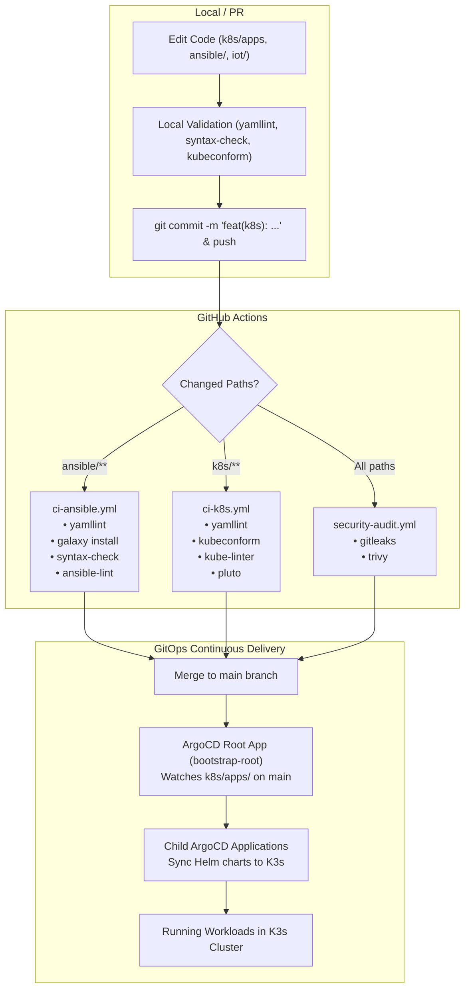

# AGENTS.md

Welcome to the **homelab-infrastructure** repository. This document provides practical guidelines, architecture overviews, build and validation commands, CI/CD pipeline descriptions, and operational patterns to help autonomous and human pair-programming agents work effectively within this codebase.

---

## 1. Project Overview & Architecture

This repository is an **Infrastructure as Code (IaC) monorepo** for a personal homelab running on a single bare-metal node. The system utilizes **Ansible** for host provisioning and system configuration, **K3s (Kubernetes)** as the container orchestrator, **ArgoCD** for declarative GitOps continuous delivery, and **ESPHome** for IoT device firmware management.

### Key Technologies
- **Base OS**: Ubuntu Server 24.04 LTS
- **Node Hardware**: Lenovo ThinkPad L480 (Intel Core i5-8250U, 4 cores / 8 threads, 8GB DDR4 RAM, NVMe SSD, battery-backed UPS)
- **Host Automation**: Ansible (`ansible-playbook`, `ansible-galaxy`, Ansible Vault)
- **Kubernetes Distribution**: K3s (single-node, includes Traefik ingress & `local-path` storage provisioner)
- **GitOps Engine**: ArgoCD (App-of-Apps pattern)
- **Package Management**: Helm (managed declaratively via ArgoCD `Application` manifests)
- **Security & Hardening**: UFW, SSH hardening, Fail2Ban with automated incident response integration, Ansible Vault, Gitleaks, Trivy
- **IoT Fleet**: ESPHome configs for ESP32 devices (e.g., Bluetooth proxy)

---

## 2. Codebase Structure

```
.
├── .github/
│   └── workflows/
│       ├── ci-ansible.yml         # Linting, syntax check & quality gate for Ansible
│       ├── ci-k8s.yml             # Yamllint, kubeconform, kube-linter, pluto for K8s
│       └── security-audit.yml     # Gitleaks & Trivy security/secret scans
├── .ansible-lint                  # Configuration for ansible-lint (excludes encrypted vault)
├── .yamllint                      # Repository-wide YAML style and formatting rules
├── AGENTS.md                      # Agent operational guide and developer reference
├── README.md                      # Project documentation and architectural overview
├── ansible/
│   ├── ansible.cfg                # Ansible defaults (inventory path, roles_path, pipelining)
│   ├── requirements.yml           # Ansible Galaxy collections requirements
│   ├── inventory/
│   │   ├── hosts                  # Inventory declaring [lab_servers] (default IP 192.168.100.30)
│   │   └── group_vars/
│   │       ├── lab_servers.yml    # Vault-encrypted host secrets (sudo pass, ssh keys, API keys)
│   │       └── lab_servers.yml.example # Template demonstrating required variable keys
│   ├── playbooks/
│   │   └── bootstrap.yml          # Main orchestration playbook executing all roles in order
│   └── roles/
│       ├── common/                # Base utilities (UTC timezone, apt packages, chrony)
│       ├── security/              # Hardening: SSH config, UFW firewall, Fail2Ban
│       ├── incident_response/     # Automated incident response tool integration
│       ├── docker/                # Official Docker CE repo & package setup
│       ├── k3s/                   # K3s installation & kubeconfig extraction
│       ├── helm/                  # Helm CLI installation
│       └── agrocd/                # ArgoCD Helm install & Traefik ingress configuration
├── docs/
│   └── infrastructure_map.md      # ASCII network topology diagram
├── iot-devices/
│   ├── ble-gateway.yml            # ESPHome configuration for ESP32 BLE proxy hub
│   └── secrets.yml                # ESPHome Wi-Fi credentials & device static IPs
└── k8s/
    ├── bootstrap.yml              # Root ArgoCD "App-of-Apps" Application manifest
    ├── repo-secret.yml            # ArgoCD repository credentials (for private repo access)
    ├── repo-secret.yml.example    # Example template for repo-secret.yml
    └── apps/                      # ArgoCD Application manifests organized in subdirectories
        ├── adguard-home/
        │   └── adguard-home.yml   # Network-wide DNS & ad-blocking (LoadBalancer on port 53)
        ├── esphome/
        │   └── esphome.yml        # ESPHome management dashboard (ingress: esphome.lan)
        ├── home-assistant/
        │   └── home-assistant.yml # Home Assistant (hostNetwork: true, ingress: home-assistant.lan)
        ├── homer-dashboard/
        │   └── homer-dashboard.yml # Personal dashboard homepage (ingress: homepage.lan)
        ├── kube-prometheus-stack/
        │   └── kube-prometheus-stack.yml # Prometheus & Grafana stack (ingress: grafana.lan)
        ├── reloader/
        │   └── reloader.yml       # Stakater Reloader for configmap/secret reloads
        └── uptime-kuma/
            └── uptime-kuma.yml    # Uptime Kuma monitoring (ingress: uptime-kuma.lan)
```

---

## 3. Build, Lint & Test Commands

Before proposing or committing changes, run the appropriate validation suites locally.

### 3.1 YAML Validation

The repository enforces strict YAML standards via [.yamllint](file:///.yamllint).

```bash
# Lint all Ansible YAML files (as done in CI)
yamllint -c .yamllint -f standard ansible/

# Lint all Kubernetes manifests (as done in CI)
yamllint -c .yamllint -f standard k8s/

# Lint entire repository
yamllint -c .yamllint -f standard .
```

### 3.2 Ansible Quality Gates

Ansible configuration requires `ansible.cfg` located at [ansible/ansible.cfg](file:///ansible/ansible.cfg).

```bash
# 1. Install required Ansible collections
ansible-galaxy collection install -r ansible/requirements.yml

# 2. Syntax-check all playbooks (requires ANSIBLE_CONFIG set)
ANSIBLE_CONFIG=ansible/ansible.cfg ansible-playbook ansible/playbooks/*.yml --syntax-check

# 3. Run Ansible Lint
ANSIBLE_CONFIG=ansible/ansible.cfg ansible-lint ansible/

# 4. Dry-run playbook execution (requires vault password and server network access)
ANSIBLE_CONFIG=ansible/ansible.cfg ansible-playbook ansible/playbooks/bootstrap.yml --check --diff --ask-vault-pass
```

### 3.3 Kubernetes Validation

Kubernetes manifests are validated against schemas, best practices, and deprecated APIs.

```bash
# 1. Validate manifests against K8s schemas (ignoring custom CRDs like ArgoCD Application)
kubeconform -summary -verbose -ignore-missing-schemas k8s/

# 2. Security and production best-practices linter
kube-linter lint k8s/

# 3. Detect deprecated K8s API versions
pluto detect-files -d k8s/ --target-versions k8s=v1.26.0
```

### 3.4 Security & Secret Auditing

CI enforces automated scanning against credential leaks and misconfigurations:

```bash
# Scan git history and working tree for secrets
gitleaks detect --source . -v

# Vulnerability / misconfiguration scan with Trivy
trivy fs --severity CRITICAL,HIGH --format table --exit-code 1 .
```

---

## 4. CI/CD Pipelines & Deployment Flow



### GitHub Actions Pipelines
1. **[Ansible Quality Gate](file:///.github/workflows/ci-ansible.yml)**:
   - Triggers on `push` and `pull_request` affecting `ansible/**`.
   - Runs `yamllint`, installs Galaxy collections from `requirements.yml`, checks playbook syntax, and runs `ansible-lint`.
2. **[K8s Quality Gate](file:///.github/workflows/ci-k8s.yml)**:
   - Triggers on `push` and `pull_request` affecting `k8s/**`.
   - Runs `yamllint`, `kubeconform`, `kube-linter`, and `pluto detect-files`.
3. **[Repository Security Gate](file:///.github/workflows/security-audit.yml)**:
   - Triggers on all pushes and pull requests to `main`.
   - Runs `gitleaks` on full git history (`fetch-depth: 0`).
   - Runs `trivy` filesystem vulnerability/misconfiguration scanner for `CRITICAL,HIGH` severities.

### GitOps Continuous Delivery (ArgoCD)
- Deployment is **pull-based**: nothing in Kubernetes is deployed via `kubectl apply` directly in CI.
- The root application [k8s/bootstrap.yml](file:///k8s/bootstrap.yml) targets `path: k8s/apps` with `directory.recurse: true`.
- Any ArgoCD `Application` YAML placed inside `k8s/apps/**/` is automatically discovered, deployed, and synchronized by ArgoCD.
- Sync policies are configured with `automated: { prune: true, selfHeal: true }` and `syncOptions: [CreateNamespace=true]`.

---

## 5. Architectural Patterns & Critical Constraints

### 5.1 Hardware Constraints (8GB Total RAM)
The physical cluster node is a repurposed laptop with **8GB of RAM**.
- **Always specify resource requests and limits** for every container/helm deployment.
- Avoid allocating disproportionately large memory requests (keep baseline requests <= 512Mi where possible).
- Examples of current allocations:
  - `home-assistant`: `requests.memory: 512Mi`, `limits.memory: 2048Mi`
  - `kube-prometheus-stack`: `prometheus.requests.memory: 512Mi`, `grafana.requests.memory: 256Mi`
  - `esphome`: `requests.memory: 512Mi`, `limits.memory: 2Gi`
  - `uptime-kuma`: `requests.memory: 128Mi`, `limits.memory: 256Mi`
  - `reloader`: `requests.memory: 128Mi`, `limits.memory: 256Mi`

### 5.2 Kubernetes / ArgoCD Conventions
- **Application format**: All manifests in `k8s/apps/**/` MUST be `apiVersion: argoproj.io/v1alpha1`, `kind: Application`.
- **Target namespace**: ArgoCD child applications declare their workload destination namespace under `spec.destination.namespace`. Make sure `spec.syncPolicy.syncOptions` includes `CreateNamespace=true`.
- **Finalizers**: Standardize on `resources-finalizer.argocd.argoproj.io` in metadata to ensure clean cascading deletes when an application manifest is removed.
- **Ingress**: K3s uses **Traefik** as its built-in ingress controller. Use local `.lan` hostnames (e.g. `<service-name>.lan`). Ingress annotations or class should specify `traefik`.
- **Storage**: K3s defaults to the `local-path` StorageClass (`storageClassName: local-path`). Use `ReadWriteOnce` for PVC access modes.
- **Host Networking**: Certain IoT services (e.g., Home Assistant) require `hostNetwork: true` and `dnsPolicy: ClusterFirstWithHostNet` for mDNS and multicast device discovery on the local subnet.

### 5.3 Secret Management & Security Rules
- **DO NOT commit plaintext secrets, tokens, or private keys.**
- **Ansible Secrets**: Managed in [ansible/inventory/group_vars/lab_servers.yml](file:///ansible/inventory/group_vars/lab_servers.yml) encrypted using `ansible-vault`. Unencrypted templates are documented in [lab_servers.yml.example](file:///ansible/inventory/group_vars/lab_servers.yml.example).
- **K8s Secrets**: ArgoCD private repository credentials are configured via [k8s/repo-secret.yml](file:///k8s/repo-secret.yml). Any app-specific secret should reference existing secrets or use encrypted management.
- **ESPHome Secrets**: Managed using `!secret` directive, mapped to [iot-devices/secrets.yml](file:///iot-devices/secrets.yml).
- **Lint Exclusion**: Encrypted files like `lab_servers.yml` are excluded in `.ansible-lint`. Never remove this exclusion.

### 5.4 Ansible Conventions
- **Pipelining**: Enabled in `ansible.cfg`.
- **Role Naming Note**: The ArgoCD role directory is named `agrocd` ([ansible/roles/agrocd](file:///ansible/roles/agrocd)) and referenced as `- role: agrocd` in [ansible/playbooks/bootstrap.yml](file:///ansible/playbooks/bootstrap.yml). Preserve this naming consistency unless executing a coordinated rename.
- **Idempotency**: All role tasks must be idempotent. Avoid bare `command` or `shell` tasks without `creates`, `removes`, or `changed_when: false`.

---

## 6. Common Recipes for Agents

### Recipe 1: Adding a New Service via ArgoCD
1. Create a new manifest file in `k8s/apps/<service-name>/<service-name>.yml`.
2. Use this template:
   ```yaml
   apiVersion: argoproj.io/v1alpha1
   kind: Application
   metadata:
     name: <service-name>
     namespace: argocd
     finalizers:
       - resources-finalizer.argocd.argoproj.io
   spec:
     project: default
     source:
       repoURL: <helm-chart-repo-url>
       chart: <chart-name>
       targetRevision: <pinned-version>
       helm:
         releaseName: <service-name>
         values: |
           replicaCount: 1
           resources:
             requests:
               cpu: 100m
               memory: 128Mi
             limits:
               cpu: 500m
               memory: 512Mi
           ingress:
             enabled: true
             hosts:
               - host: <service-name>.lan
                 paths:
                   - path: /
                     pathType: Prefix
     destination:
       server: "https://kubernetes.default.svc"
       namespace: <service-name>
     syncPolicy:
       automated:
         prune: true
         selfHeal: true
       syncOptions:
         - CreateNamespace=true
   ```
3. Run validations:
   ```bash
   yamllint -c .yamllint -f standard k8s/apps/<service-name>/<service-name>.yml
   kubeconform -summary -verbose -ignore-missing-schemas k8s/
   ```

### Recipe 2: Updating an Existing Application Version
1. Identify the target file in `k8s/apps/<app>/<app>.yml`.
2. Update `targetRevision` (for Helm charts) or `image.tag` under `helm.values`.
3. Check release notes for breaking changes in values schema.
4. Run `yamllint -c .yamllint -f standard k8s/` and commit using `chore(<app>): bump version to ...`.

### Recipe 3: Adding or Modifying Ansible Tasks/Roles
1. Navigate to the relevant role under `ansible/roles/<role-name>/tasks/`.
2. Ensure new tasks use FQCN (Fully Qualified Collection Names) like `ansible.builtin.<module>` or `community.general.<module>`.
3. If new collections are required, add them to `ansible/requirements.yml`.
4. Validate:
   ```bash
   yamllint -c .yamllint -f standard ansible/
   ANSIBLE_CONFIG=ansible/ansible.cfg ansible-playbook ansible/playbooks/bootstrap.yml --syntax-check
   ```

---

## 7. Commit & Pull Request Conventions

Commit messages must follow **Conventional Commits**:
- `feat(<scope>): add new service or feature` (e.g. `feat(k8s): deploy reloader`)
- `fix(<scope>): resolve a bug or configuration error` (e.g. `fix(monitoring): fix sync errors`)
- `chore(<scope>): routine maintenance, version bumps` (e.g. `chore(home-assistant): update helm chart`)
- `refactor(<scope>): architectural optimization or restructuring` (e.g. `refactor(iot): optimize memory partitions`)

Scopes should correspond to components: `k8s`, `ansible`, `iot`, `<app-name>` (e.g. `home-assistant`, `monitoring`, `esphome`).
